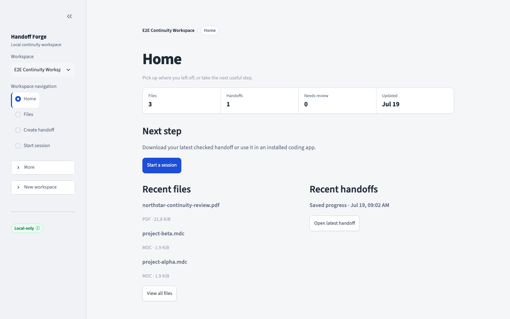

# Handoff Forge

Turn project files into a clear, validated handoff so the next coding session can continue without rebuilding context from memory.



Handoff Forge is a private, local-first workspace for one simple flow:

1. **Files** — add Markdown, handoff (`.mdc`), or PDF files.
2. **Create handoff** — save work in progress or package completed work.
3. **Start session** — download the checked handoff or, when a supported CLI is installed, prepare
   a new Codex, Claude, Gemini, or Grok session.

No account or API key is required. The default workflow runs locally and makes no remote model calls.

## Fastest start: Docker

Install [Docker Desktop](https://www.docker.com/products/docker-desktop/), then run:

```bash
git clone https://github.com/ownasquare/handoff-forge.git
cd handoff-forge
docker compose up --build
```

Open [http://127.0.0.1:8517](http://127.0.0.1:8517) and choose **Explore sample workspace**. Press `Ctrl+C` to stop the app; your work remains in the private Docker volume.

Docker is the simplest way to create and download handoffs. It does not automatically see coding
CLIs installed on the host; use the source install when you want in-app launch-command preparation.

## Install from source

You need Python 3.11–3.13 and [uv](https://docs.astral.sh/uv/getting-started/installation/).

```bash
git clone https://github.com/ownasquare/handoff-forge.git
cd handoff-forge
uv sync --no-dev --frozen
uv run --no-dev --frozen handoff-forge doctor
uv run --no-dev --frozen handoff-forge ui --port 8517
```

Then open [http://127.0.0.1:8517](http://127.0.0.1:8517). The [getting-started guide](docs/getting-started.md) covers operating-system notes, the sample workspace, and the command-line workflow.

## What stays private

- Original files and generated handoffs stay in a private application-data folder.
- Remote processing is off by default.
- Choosing a remote provider still requires explicit consent for that run.
- Remote links in Markdown are recorded but never fetched automatically.

Read [Security and privacy](docs/security.md) before enabling network providers.

## Documentation

- [Getting started](docs/getting-started.md)
- [Troubleshooting](docs/troubleshooting.md)
- [Two-minute sample](examples/README.md)
- [Architecture](docs/architecture.md)
- [Extending Handoff Forge](docs/extending.md)
- [Model providers](docs/providers.md)
- [Destination app integrations](docs/harness-integrations.md)
- [Contributing](CONTRIBUTING.md) and [support](SUPPORT.md)

## Project status

Version 0.3.0 is a local, single-user beta. Local validation does not imply hosted, multi-user, live-provider, or production readiness. See [current limitations](docs/limitations.md) for the exact boundaries.

## License

[MIT](LICENSE)
