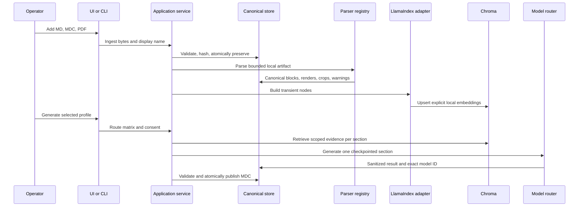

# Architecture

## Design principles

1. **Canonical before convenient.** Original bytes and provider-neutral JSON manifests are the
   source of truth. Framework nodes, vectors, UI state, and provider objects are replaceable.
2. **Local before remote.** Parsing, artifact preservation, indexing, search, composition, merge,
   and validation all work without credentials or outbound requests.
3. **Evidence before prose.** Every block and generated section retains source hashes and page or
   line locations. Unknown evidence is represented explicitly.
4. **Profiles before a universal template.** The 12 sections are invariant, but pre-compact and
   post-chat wrappers remain versioned because their governing rules differ.
5. **Argument vectors before shell strings.** Harness and filesystem actions never interpolate
   untrusted content into a shell command.

## Data flow



## Storage layout

Each project has a generated identifier and a contained directory:

```text
projects/<project-id>/
  project.json
  artifacts/<sha256-prefix>/<sha256>-<safe-name>
  parsed/<artifact-id>.json
  derived/<artifact-id>/page-001.png
  jobs/<job-id>.json
  outputs/<collision-resistant-name>.mdc
indexes/chroma/
```

Original bytes are immutable. Parsed manifests and outputs use temporary files plus atomic replace.
The project lock serializes writers. Chroma collections are fingerprinted by schema, embedding
provider, exact model, dimension, and modality; an incompatible fingerprint creates a separate
collection rather than mixing vectors.

## Multimodal parsing

- Markdown and MDC preserve frontmatter, headings, lists, code fences, links, and source lines.
- Relative local assets are preserved only when their resolved path remains inside the source
  directory. Supported local image references also become canonical `IMAGE` blocks whose managed
  artifact paths and alt text or filename-derived descriptions remain tied to source lines. Remote
  assets are recorded but never fetched automatically.
- pdfplumber extracts native text and tables.
- pypdfium2 renders every accepted page so images, charts, diagrams, and scans remain inspectable.
- pytesseract runs only on low-text pages and only when its executable is available. Timeouts and
  language settings are recorded; OCR absence, timeout, or failure never discards the render.
- Every PDF page render and extracted image block receives a bounded copy of available same-page
  native text/table context and, when OCR ran successfully, a separately labeled bounded OCR
  excerpt. Local and Voyage indexes embed this node text only, so a query can select a related
  managed visual without claiming that the embedding model interpreted its pixels.
- After scoped text retrieval, a vision-capable generation provider may receive only the selected
  project-managed render or crop, and only after artifact-root containment, capability preflight,
  and explicit cloud-upload consent. The current adapters do not send native PDFs and do not use a
  provider document-search route.

## Generation and merge

The job runner retrieves evidence separately for every required section and checkpoints after each
successful route. Inventory precedes Section 10. Sections 1-11 precede the confidence assessment in
Section 12. A failed job cannot publish a valid-looking final package.

Merge validates every input, de-duplicates identical content hashes, normalizes sources into stable
`S1`, `S2`, and later identifiers, preserves contradictions, carries old security and Do Not Touch
constraints forward, and emits both the normalized handoff core and a unified execution plan.

## Scaling boundary

The default architecture is single-user and single-host. Chroma's persistent client is serialized
locally. Multi-user hosted operation requires external identity, tenant-aware object storage and
retrieval filters, a database-backed job queue, server-mode vector storage, encryption policy,
auditing, and independent production proof.
